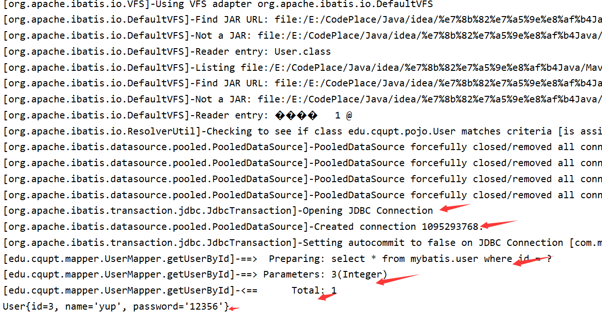

# Mybatis

# 搭建第一个Mybatis程序


## 导入相应maven依赖,配置资源导出路径

**pom.xml**

```xml
 <!--导入依赖-->
    <dependencies>
        <!--mysql驱动-->
        <dependency>
            <groupId>mysql</groupId>
            <artifactId>mysql-connector-java</artifactId>
            <version>5.1.47</version>
        </dependency>
        <!--mybatis-->
        <!-- https://mvnrepository.com/artifact/org.mybatis/mybatis -->
        <dependency>
            <groupId>org.mybatis</groupId>
            <artifactId>mybatis</artifactId>
            <version>3.5.2</version>
        </dependency>
        <!--junit-->
        <dependency>
            <groupId>junit</groupId>
            <artifactId>junit</artifactId>
            <version>4.12</version>
        </dependency>
    </dependencies>
    <!--在build中配置resources，来防止我们资源导出失败的问题-->
    <build>
        <resources>
            <resource>
                <directory>src/main/resources</directory>
                <includes>
                    <include>**/*.properties</include>
                    <include>**/*.xml</include>
                </includes>
                <filtering>true</filtering>
            </resource>
            <resource>
                <directory>src/main/java</directory>
                <includes>
                    <include>**/*.properties</include>
                    <include>**/*.xml</include>
                </includes>
                <filtering>true</filtering>
            </resource>
        </resources>
    </build>
```

## 编写实体类

```
package edu.cqupt.pojo;
//实体类
public class User {
    private int id;
    private String name;
    private String pwd;

    public User() {
    }

    public User(int id, String name, String pwd) {
        this.id = id;
        this.name = name;
        this.pwd = pwd;
    }

    public int getId() {
        return id;
    }

    public void setId(int id) {
        this.id = id;
    }

    public String getName() {
        return name;
    }

    public void setName(String name) {
        this.name = name;
    }

    public String getPwd() {
        return pwd;
    }

    public void setPwd(String pwd) {
        this.pwd = pwd;
    }

    @Override
    public String toString() {
        return "User{" +
                "id=" + id +
                ", name='" + name + '\'' +
                ", pwd='" + pwd + '\'' +
                '}';
    }
}
```

## 编写工具类

在 **edu.cqupt.utilutils** 路径下创建一个`**MybatisUtils.java**`

```
package edu.cqupt.utils;

import org.apache.ibatis.io.Resources;
import org.apache.ibatis.session.SqlSession;
import org.apache.ibatis.session.SqlSessionFactory;
import org.apache.ibatis.session.SqlSessionFactoryBuilder;

import java.io.IOException;
import java.io.InputStream;

public class MybatisUtils {
    private static SqlSessionFactory sqlSessionFactory;
    static{
        try {
            String resource = "mybatis-config.xml";
            InputStream inputStream = Resources.getResourceAsStream(resource);
            sqlSessionFactory = new SqlSessionFactoryBuilder().build(inputStream);
        } catch (IOException e) {
            e.printStackTrace();
        }
    }
    public static SqlSession  getSqlSession(){
        return sqlSessionFactory.openSession();
    }

}
```

## 添加核心配置文件

在上面的工具类中需要一个**mybatis-config.xml** 文件，于是在resources目录下创建一个`**mybatis-config.xml**`

```
<?xml version="1.0" encoding="UTF-8"?>
<!DOCTYPE configuration
        PUBLIC "-//mybatis.org//DTD Config 3.0//EN"
        "http://mybatis.org/dtd/mybatis-3-config.dtd">

<configuration>
    <environments default="development">
        <environment id="development">
            <transactionManager type="JDBC"/>
            <dataSource type="POOLED">
                <property name="driver" value="com.mysql.jdbc.Driver"/>
                <property name="url" value="jdbc:mysql://localhost:3306/mybatis?useSSL=true&amp;useUnicode=true&amp;characterEncoding=UTF-8"/>
                <property name="username" value="root"/>
                <property name="password" value="123456"/>
            </dataSource>
        </environment>
    </environments>
    <mappers>
        <mapper resource="edu/cqupt/mapper/UserMapper.xml"/>
    </mappers>
</configuration>
```

其中：

- environment：配置的是mysql数据库的参数
- mapper 添加的是Mapeer.xml的映射

因此我们需要编写Mapeer.xml文件

在**edu.cqupt.mapper**路径下创建：`UserMpper` 接口

## 编写Mapeer接口并实现

```
package edu.cqupt.mapper;

import edu.cqupt.pojo.User;
import java.util.List;

public interface UserMapper {
    List<User> getUserList();

}
```

用UserMapper.xml 实现接口

```
<?xml version="1.0" encoding="UTF-8" ?>
<!DOCTYPE mapper
        PUBLIC "-//mybatis.org//DTD Mapper 3.0//EN"
        "http://mybatis.org/dtd/mybatis-3-mapper.dtd">

<mapper namespace="edu.cqupt.mapper.UserMapper">
    <select id="getUserList" resultType="edu.cqupt.pojo.User">
      select * from mybatis.user
   </select>
</mapper>
```

## 编写测试类

```
package edu.cqupt.mapper;

import edu.cqupt.pojo.User;
import edu.cqupt.utils.MybatisUtils;
import org.apache.ibatis.session.SqlSession;
import org.junit.Test;
import java.util.List;

public class UserMapperTest {
    @Test
    public void getUserList(){
        SqlSession sqlSession = MybatisUtils.getSqlSession();
        UserMapper mapper = sqlSession.getMapper(UserMapper.class);
        List<User> userList = mapper.getUserList();
        for (User user : userList) {
            System.out.println(user);
        }
    }
}
```


# CUID

## 查询数据

```
  User getUserById(int id);
<select id="getUserById" parameterType="int" resultType="edu.cqupt.pojo.User">
        select * from mybatis.user where id = #{id}
    </select>
     @Test
    public void getUserById(){
        SqlSession sqlSession = MybatisUtils.getSqlSession();
        UserMapper mapper = sqlSession.getMapper(UserMapper.class);
        User user = mapper.getUserById(2);
        System.out.println(user);
    }
```

**注：增删改需要提交事务：** **sqlSession.commit();**

## 插入数据

```
int addUser(User user);
 <insert id="addUser" parameterType="edu.cqupt.pojo.User">
        insert into mybatis.user(id,name,pwd) values(#{id},#{name},#{pwd})
</insert>
@Test
    public void addUser(){
        SqlSession sqlSession = MybatisUtils.getSqlSession();
        UserMapper mapper = sqlSession.getMapper(UserMapper.class);
        int res = mapper.addUser(new User(4, "why", "12344"));
        sqlSession.commit();    //一定要注意提交事务，否则该操作是无效的
        if(res >0){
            System.out.println("插入成功");
        }
        sqlSession.close();
    }
```

## 修改数据

```
 int updateUser(User user);
   <update id="updateUser" parameterType="edu.cqupt.pojo.User">
        update mybatis.user set name = #{name}, pwd = #{pwd} where id =#{id}
    </update>
    @Test
    public void updateUser(){
        SqlSession sqlSession = MybatisUtils.getSqlSession();
        UserMapper mapper = sqlSession.getMapper(UserMapper.class);
        int res = mapper.updateUser(new User(2, "cx", "12356"));
        sqlSession.commit();
        if(res >0){
            System.out.println("更新成功");
        }
        sqlSession.close();
    }
```

## 删除数据

```
int deleteUser(int id);
 <delete id="deleteUser" parameterType="int">
        delete from mybatis.user where id = #{id}
</delete>
 @Test
    public void deleteUser(){
        SqlSession sqlSession = MybatisUtils.getSqlSession();
        UserMapper mapper = sqlSession.getMapper(UserMapper.class);
        int res = mapper.deleteUser(7);
        sqlSession.commit();
        if(res >0){
            System.out.println("删除成功");
        }
        sqlSession.close();
    }
```

## 万能的Map

假设，我们的实体类，或者数据库中的表，字段或者参数过多，我们应当考虑使用Map！


```
    //万能的Map
    int addUser2(Map<String,Object> map);
```


```
    <!--对象中的属性，可以直接取出来传递map的key-->
    <insert id="addUser" parameterType="map">
        insert into mybatis.user (id, pwd) values (#{userid},#{passWord});
    </insert>
```


```
    @Test
    public void addUser2(){
        SqlSession sqlSession = MybatisUtils.getSqlSession();
        UserMapper mapper = sqlSession.getMapper(UserMapper.class);
        Map<String, Object> map = new HashMap<String, Object>();
        map.put("userid",5);
        map.put("passWord","2222333");
        mapper.addUser2(map);
        sqlSession.close();
    }
```


Map传递参数，直接在sql中取出key即可！     【parameterType="map"】

对象传递参数，直接在sql中取对象的属性即可！【parameterType="Object"】

只有一个基本类型参数的情况下，可以直接在sql中取到！

多个参数用Map，**或者注解！**

## 模糊查询

```
List<User> getUserByLike(String value);
```

- 第一种SQL（推荐）

```
<select id="getUserByLike"  resultType="edu.cqupt.pojo.User">
         select * from mybatis.user where name like #{value}
</select>
```

- 第二种SQL（不推荐，会存在SQL注入）

```
<select id="getUserByLike"  resultType="edu.cqupt.pojo.User">
       select * from mybatis.user where name like "%"#{value}"%"
</select>
@Test
public void getUserByLike(){
        SqlSession sqlSession = MybatisUtils.getSqlSession();
        UserMapper mapper = sqlSession.getMapper(UserMapper.class);
        List<User> userList = mapper.getUserByLike("%z%");
        //List<User> userList = mapper.getUserByLike("z");
        for (User user : userList) {
            System.out.println(user);
        }
}
```

# 配置解析

## 核心配置文件

- mybatis-config.xml
- MyBatis 的配置文件包含了会深深影响 MyBatis 行为的设置和属性信息。 
- configuration（配置）
- properties（属性）
- settings（设置）
- typeAliases（类型别名）
- typeHandlers（类型处理器）
- objectFactory（对象工厂）
- plugins（插件）
- environments（环境配置）
- environment（环境变量）
- transactionManager（事务管理器）
- dataSource（数据源）
- databaseIdProvider（数据库厂商标识）
- mappers（映射器）

## 环境配置（environments）

MyBatis 可以配置成适应多种环境

**不过要记住：尽管可以配置多个环境，但每个 SqlSessionFactory 实例只能选择一种环境。**

学会使用配置多套运行环境！

Mybatis默认的事务管理器就是 **JDBC** （还有一种是MANAGED） ， 连接池 ： **POOLED**（还有两种是UNPOOLED 和 JNDI）

## 属性（properties）

我们可以通过properties属性来实现引用配置文件，这些属性都是可外部配置且可动态替换的，既可以在典型的 Java 属性文件中配置，亦可通过 properties 元素的子元素来传递。【db.properties】


编写一个配置文件

db.properties

```
driver=com.mysql.jdbc.Driver
url=jdbc:mysql://localhost:3306/mybatis?useSSL=true&useUnicode=true&characterEncoding=UTF-8
username=root
password=123456
```

在核心配置文件中映入

```
<!--引入外部配置文件-->
    <properties resource="db.properties">
        <property name="username" value="root"/>
        <property name="pwd" value="11111"/>
    </properties>
```

- 可以直接引入外部文件
- 可以在其中增加一些属性配置
- 如果两个文件有同一个字段，优先使用外部配置文件的！

## 类型别名（typeAliases）

- 类型别名是为 Java 类型设置一个短的名字。
- 存在的意义：仅在于用来减少类完全限定名的冗余。

```
<!--可以给实体类起别名-->
    <typeAliases>
        <typeAlias type="com.kuang.pojo.User" alias="User"/>
    </typeAliases>
```

  

也可以指定一个包名，MyBatis 会在包名下面搜索需要的 Java Bean，比如：扫描实体类的包，它的默认别名就为这个类的类名，首字母小写！

```
<!--可以给实体类起别名-->
<typeAliases>
    <package name="com.kuang.pojo"/>
</typeAliases>
```

**在实体类比较少的时候，使用第一种方式。如果实体类十分多，建议使用第二种。**

第一种可以DIY别名，第二种则·不行·，如果非要改，需要在实体上增加注解

```
@Alias("user")
public class User {}
```

## 设置

这是 MyBatis 中极为重要的调整设置，它们会改变 MyBatis 的运行时行为。 


## 其他配置

- [typeHandlers（类型处理器）](https://mybatis.org/mybatis-3/zh/configuration.html#typeHandlers)
- [objectFactory（对象工厂）](https://mybatis.org/mybatis-3/zh/configuration.html#objectFactory)
- plugins插件

- - mybatis-generator-core
  - mybatis-plus
  - 通用mapper

## 映射器（mappers）

**MapperRegistry：**注册绑定我们的Mapper文件；

方式一： 【推荐使用】

```
<!--每一个Mapper.XML都需要在Mybatis核心配置文件中注册！-->
<mappers>
    <mapper resource="com/kuang/dao/UserMapper.xml"/>
</mappers>
```

方式二：使用class文件绑定注册

```
<!--每一个Mapper.XML都需要在Mybatis核心配置文件中注册！-->
<mappers>
    <mapper class="com.kuang.dao.UserMapper"/>
</mappers>
```

**注意点：**

- 接口和他的Mapper配置文件必须同名！
- 接口和他的Mapper配置文件必须在同一个包下！

方式三：使用扫描包进行注入绑定

```
<!--每一个Mapper.XML都需要在Mybatis核心配置文件中注册！-->
<mappers>
    <package name="com.kuang.dao"/>
</mappers>
```

**注意点：**

- **接口和他的Mapper配置文件必须同名！**
- **接口和他的Mapper配置文件必须在同一个包下！**
- **
  **

练习时间：

- 将数据库配置文件外部引入
- 实体类别名
- 保证UserMapper 接口 和 UserMapper .xml 改为一致！并且放在同一个包下！

## 生命周期和作用域


生命周期，和作用域，是至关重要的，因为错误的使用会导致非常严重的**并发问题**。

**SqlSessionFactoryBuilder：**

- 一旦创建了 SqlSessionFactory，就不再需要它了
- 局部变量

**SqlSessionFactory：**

- 说白了就是可以想象为 ：数据库连接池
- SqlSessionFactory 一旦被创建就应该在应用的运行期间一直存在，**没有任何理由丢弃它或重新创建另一个实例。** 
- 因此 SqlSessionFactory 的**最佳作用域是应用作用域。** 
- 最简单的就是使用**单例模式**或者静态单例模式。

**SqlSession**

- 连接到连接池的一个请求！
- **SqlSession 的实例不是线程安全的，因此是不能被共享的**，所以它的最佳的作用域是请求或方法作用域。
- 用完之后需要赶紧关闭，否则资源被占用！


这里面的每一个Mapper，就代表一个具体的业务！

# 解决属性名和字段名不一致的问题

## 问题


数据库中的字段


新建一个项目，拷贝之前的，测试实体类字段不一致的情况


```
public class User {
    
    private int id;
    private String name;
    private String password;
}
```


测试出现问题


```
//    select * from mybatis.user where id = #{id}
//类型处理器
//    select id,name,pwd from mybatis.user where id = #{id}
```


解决方法：

- 起别名

```
<select id="getUserById" resultType="com.kuang.pojo.User">
    select id,name,pwd as password from mybatis.user where id = #{id}
</select>
```

## resultMap

结果集映射

```
id   name   pwd
id   name   password
```


```
<!--结果集映射-->
<resultMap id="UserMap" type="User">
    <!--column数据库中的字段，property实体类中的属性-->
    <result column="id" property="id"/>
    <result column="name" property="name"/>
    <result column="pwd" property="password"/>
</resultMap>

<select id="getUserById" resultMap="UserMap">
    select * from mybatis.user where id = #{id}
</select>
```


- `resultMap` 元素是 MyBatis 中最重要最强大的元素
- ResultMap 的设计思想是，对于简单的语句根本不需要配置显式的结果映射，而对于复杂一点的语句只需要描述它们的关系就行了。
- `ResultMap` 最优秀的地方在于，虽然你已经对它相当了解了，但是根本就不需要显式地用到他们。
- 如果世界总是这么简单就好了。


# 日志

## 日志工厂

如果一个数据库操作，出现了异常，我们需要排错。日志就是最好的助手！曾经：sout 、debug。现在：日志工厂！


- SLF4J 
- **LOG4J  【掌握】**
- LOG4J2
- JDK_LOGGING
- COMMONS_LOGGING
- **STDOUT_LOGGING  【掌握】**
- NO_LOGGING

在Mybatis中具体使用那个一日志实现，在设置中设定！**STDOUT_LOGGING标准日志输出。**在mybatis核心配置文件中，配置我们的日志！

```
<settings>
    <setting name="logImpl" value="STDOUT_LOGGING"/>
</settings>
```


## Log4j

什么是Log4j？

- Log4j是[Apache](https://baike.baidu.com/item/Apache/8512995)的一个开源项目，通过使用Log4j，我们可以控制日志信息输送的目的地是[控制台](https://baike.baidu.com/item/控制台/2438626)、文件、[GUI](https://baike.baidu.com/item/GUI)组件
- 我们也可以控制每一条日志的输出格式；
- 通过定义每一条日志信息的级别，我们能够更加细致地控制日志的生成过程。
- 通过一个[配置文件](https://baike.baidu.com/item/配置文件/286550)来灵活地进行配置，而不需要修改应用的代码。


- **先导入log4j的包**

```
<!-- https://mvnrepository.com/artifact/log4j/log4j -->
<dependency>
    <groupId>log4j</groupId>
    <artifactId>log4j</artifactId>
    <version>1.2.17</version>
</dependency>
```

- **log4j.properties**

```
#将等级为DEBUG的日志信息输出到console和file这两个目的地，console和file的定义在下面的代码
log4j.rootLogger=DEBUG,console,file
#控制台输出的相关设置
log4j.appender.console = org.apache.log4j.ConsoleAppender
log4j.appender.console.Target = System.out
log4j.appender.console.Threshold=DEBUG
log4j.appender.console.layout = org.apache.log4j.PatternLayout
log4j.appender.console.layout.ConversionPattern=[%c]-%m%n
#文件输出的相关设置
log4j.appender.file = org.apache.log4j.RollingFileAppender
log4j.appender.file.File=./log/kuang.log
log4j.appender.file.MaxFileSize=10mb
log4j.appender.file.Threshold=DEBUG
log4j.appender.file.layout=org.apache.log4j.PatternLayout
log4j.appender.file.layout.ConversionPattern=[%p][%d{yy-MM-dd}][%c]%m%n
#日志输出级别
log4j.logger.org.mybatis=DEBUG
log4j.logger.java.sql=DEBUG
log4j.logger.java.sql.Statement=DEBUG
log4j.logger.java.sql.ResultSet=DEBUG
log4j.logger.java.sql.PreparedStatement=DEBUG
```

- **配置log4j为日志的实现**

```
<settings>
    <setting name="logImpl" value="LOG4J"/>
</settings>
```

Log4j的使用, 直接测试运行刚才的查询


**简单使用**

1. 在要使用Log4j 的类中,导入包 ` import org.``**apache**``.log4j.Logger;`
2. 日志对象，参数为当前类的class

```
static`` ``Logger`` ``logger`` ``=`` ``Logger``.``getLogger``(``UserDaoTest``.``class``);
```

1. 日志级别

```
logger.info("info:进入了testLog4j");
logger.debug("debug:进入了testLog4j");
logger.error("error:进入了testLog4j");
```

# 分页


**思考：****为什么要分页？**

**
**

- 减少数据的处理量

## 使用Limit分页

语法：`SELECT * from user limit startIndex,pageSize;`

  `SELECT`` * ``from`` user ``limit`` ``3``;  #[``0``,n]`

使用Mybatis实现分页，核心SQL

1. 接口

```
//分页
List<User> getUserByLimit(Map<String,Integer> map);
```

**UserMapper.xml**

```
<!--//分页-->
<select id="getUserByLimit" parameterType="map" resultMap="UserMap">
    select * from  mybatis.user limit #{startIndex},#{pageSize}
</select>
```

**测试**

```
@Test
public void getUserByLimit(){
SqlSession sqlSession = MybatisUtils.getSqlSession();
UserMapper mapper = sqlSession.getMapper(UserMapper.class);
HashMap<String, Integer> map = new HashMap<String, Integer>();
    map.put("startIndex",1);
    map.put("pageSize",2);
    List<User> userList =  mapper.getUserByLimit(map);
    for (User user : userList) {
        System.out.println(user);
    }
    sqlSession.close();
}
```


## RowBounds分页

不再使用SQL实现分页

**接口**

```
//分页2
List<User> getUserByRowBounds();
```

**UserMapper.xml**

```
<!--分页2-->
<select id="getUserByRowBounds" resultMap="UserMap">
    select * from  mybatis.user
</select>
```

**测试**

```
@Test
public void getUserByRowBounds(){
SqlSession sqlSession = MybatisUtils.getSqlSession();
//RowBounds实现
RowBounds rowBounds = new RowBounds(1, 2);
//通过Java代码层面实现分页
List<User> userList = sqlSession.selectList("com.kuang.dao.UserMapper.getUserByRowBounds",null,rowBounds);
    for (User user : userList) {
    System.out.println(user);
    }
    sqlSession.close();
}
```

## 分页插件


了解即可，需要使用，需要知道它是什么东西！


# 使用注解开发


## 面向接口编程


- 大家之前都学过面向对象编程，也学习过接口，但在真正的开发中，很多时候我们会选择面向接口编程
- **根本原因 :  解耦 , 可拓展 , 提高复用 , 分层开发中 , 上层不用管具体的实现 , 大家都遵守共同的标准 , 使得开发变得容易 , 规范性更好**
- 在一个面向对象的系统中，系统的各种功能是由许许多多的不同对象协作完成的。在这种情况下，各个对象内部是如何实现自己的,对系统设计人员来讲就不那么重要了；
- 而各个对象之间的协作关系则成为系统设计的关键。小到不同类之间的通信，大到各模块之间的交互，在系统设计之初都是要着重考虑的，这也是系统设计的主要工作内容。面向接口编程就是指按照这种思想来编程。


**关于接口的理解**


- 接口从更深层次的理解，应是定义（规范，约束）与实现（名实分离的原则）的分离。
- 接口的本身反映了系统设计人员对系统的抽象理解。
- 接口应有两类：
- 第一类是**对一个个体的抽象**，它可对应为一个抽象体(**abstract clas**s)；
- 第二类是**对一个个体某一方面的抽象**，即形成一个抽象面（**interface**）；
- 一个体有可能有多个抽象面。抽象体与抽象面是有区别的。


**三个面向区别**


- 面向对象是指，我们考虑问题时，以对象为单位，考虑它的属性及方法 .
- 面向过程是指，我们考虑问题时，以一个具体的流程（事务过程）为单位，考虑它的实现 .
- 接口设计与非接口设计是针对复用技术而言的，与面向对象（过程）不是一个问题.更多的体现就是对系统整体的架构


## 使用注解开发


1. 注解在接口上实现

```
@Select("select * from user")
List<User> getUsers();
```

1. 需要再核心配置文件中绑定接口！

```
<!--绑定接口-->
<mappers>
    <mapper class="com.kuang.dao.UserMapper"/>
</mappers>
```

1. 测试


**本质：****反射机制实现**

**底层：****动态代理！**

​       

**Mybatis详细的执行流程！**

​     

## CRUD

我们可以在工具类创建的时候实现**自动提交事务！**

```
public static SqlSession  getSqlSession(){
    return sqlSessionFactory.openSession(true);
}
```


编写接口，增加注解

```
public interface UserMapper {

    @Select("select * from user")
    List<User> getUsers();

    // 方法存在多个参数，所有的参数前面必须加上 @Param("id")注解
    @Select("select * from user where id = #{id}")
    User getUserByID(@Param("id") int id);


    @Insert("insert into user(id,name,pwd) values (#{id},#{name},#{password})")
    int addUser(User user);

    
    @Update("update user set name=#{name},pwd=#{password} where id = #{id}")
    int updateUser(User user);

    
    @Delete("delete from user where id = #{uid}")
    int deleteUser(@Param("uid") int id);
}
```


测试类

```
public class UserMapperTest {
    @Test
    public void getUsers(){
         SqlSession sqlSession = MybatisUtils.getSqlSession();
         UserMapper mapper = sqlSession.getMapper(UserMapper.class);
         List<User> userList = mapper.getUsers();
         for (User user : userList) {
             System.out.println(user);
         }
    }
    @Test
    public void getUsersByIdName(){
        SqlSession sqlSession = MybatisUtils.getSqlSession();
        UserMapper mapper = sqlSession.getMapper(UserMapper.class);
        User user = mapper.getUserByIdName(1, "zsl");
        System.out.println(user);

    }
    @Test
    public void addUser(){
        SqlSession sqlSession = MybatisUtils.getSqlSession();
        UserMapper mapper = sqlSession.getMapper(UserMapper.class);
        int hello = mapper.addUser(new User(9, "hello", "123456"));
        System.out.println(hello);
    }
    @Test
    public void updateUser(){
        SqlSession sqlSession = MybatisUtils.getSqlSession();
        UserMapper mapper = sqlSession.getMapper(UserMapper.class);
        int hello = mapper.updateUser(new User(9, "haha", "123456"));
        System.out.println(hello);
    }
    @Test
    public void deleteUser(){
        SqlSession sqlSession = MybatisUtils.getSqlSession();
        UserMapper mapper = sqlSession.getMapper(UserMapper.class);
        int hello = mapper.deleteUser(9);
        System.out.println(hello);
    }
}
```

【注意：我们必须要讲接口注册绑定到我们的核心配置文件中！】


**关于@Param() 注解**

- 基本类型的参数或者String类型，需要加上
- 引用类型不需要加
- 如果只有一个基本类型的话，可以忽略，但是建议大家都加上！
- 我们在SQL中引用的就是我们这里的 @Param() 中设定的属性名！**
  **
- **
  **

**mybatis中的#和$的区别：**

**
**

> 1、#将传入的数据都当成一个字符串，会对自动传入的数据加一个双引号。   如：where username=#{username}，如果传入的值是111,那么解析成sql时的值为where username="111", 如果传入的值是id，则解析成的sql为where username="id".　2、$将传入的数据直接显示生成在sql中。

>    如：where username=${username}，如果传入的值是111,那么解析成sql时的值为where username=111；

> 如果传入的值是;drop table user;，则解析成的sql为：select id, username, password, role from user where username=;drop table user;

> 3、#方式能够很大程度防止sql注入，$方式无法防止Sql注入。

> 4、$方式一般用于传入数据库对象，例如传入表名.

> 5、一般能用#的就别用$，若不得不使用“${xxx}”这样的参数，要手工地做好过滤工作，来防止sql注入攻击。

> 6、在MyBatis中，“${xxx}”这样格式的参数会直接参与SQL编译，从而不能避免注入攻击。但涉及到动态表名和列名时，只能使用“${xxx}”这样的参数格式。所以，这样的参数需要我们在代码中手工进行处理来防止注入。

**【结论】在编写MyBatis的映射语句时，尽量采用“#{xxx}”这样的格式。若不得不使用“${xxx}”这样的参数，要手工地做好过滤工作，来防止SQL注入攻击。参考**： https://www.cnblogs.com/myseries/p/10821372.html

# Lombok

```
Project Lombok is a java library that automatically plugs into your editor and build tools, spicing up your java.
Never write another getter or equals method again, with one annotation your class has a fully featured builder, Automate your logging variables, and much more.
```

- java library
- plugs
- build tools
- with one annotation your class

使用步骤：

1. 在IDEA中安装Lombok插件！
2. 在项目中导入lombok的jar包

```
<dependency>
    <groupId>org.projectlombok</groupId>
    <artifactId>lombok</artifactId>
    <version>1.18.10</version>
</dependency>
```

1. 在实体类上加注解即可！

```
@Data
@AllArgsConstructor
@NoArgsConstructor
```


```
@Getter and @Setter
@FieldNameConstants
@ToString
@EqualsAndHashCode
@AllArgsConstructor, @RequiredArgsConstructor and @NoArgsConstructor
@Log, @Log4j, @Log4j2, @Slf4j, @XSlf4j, @CommonsLog, @JBossLog, @Flogger
@Data
@Builder
@Singular
@Delegate
@Value
@Accessors
@Wither
@SneakyThrows
```


说明：


```
@Data：无参构造，get、set、tostring、hashcode，equals
@AllArgsConstructor
@NoArgsConstructor
@EqualsAndHashCode
@ToString
@Getter
```

# 多对一处理

## 多对一处理


多对一：

- 多个学生，对应一个老师
- 对于学生这边而言，  **关联** ..  多个学生，关联一个老师  【多对一】
- 对于老师而言， **集合** ， 一个老师，有很多学生 【一对多】


SQL：


```
CREATE TABLE `teacher` (
  `id` INT(10) NOT NULL,
  `name` VARCHAR(30) DEFAULT NULL,
  PRIMARY KEY (`id`)
) ENGINE=INNODB DEFAULT CHARSET=utf8

INSERT INTO teacher(`id`, `name`) VALUES (1, '秦老师'); 

CREATE TABLE `student` (
  `id` INT(10) NOT NULL,
  `name` VARCHAR(30) DEFAULT NULL,
  `tid` INT(10) DEFAULT NULL,
  PRIMARY KEY (`id`),
  KEY `fktid` (`tid`),
  CONSTRAINT `fktid` FOREIGN KEY (`tid`) REFERENCES `teacher` (`id`)
) ENGINE=INNODB DEFAULT CHARSET=utf8


INSERT INTO `student` (`id`, `name`, `tid`) VALUES ('1', '小明', '1'); 
INSERT INTO `student` (`id`, `name`, `tid`) VALUES ('2', '小红', '1'); 
INSERT INTO `student` (`id`, `name`, `tid`) VALUES ('3', '小张', '1'); 
INSERT INTO `student` (`id`, `name`, `tid`) VALUES ('4', '小李', '1'); 
INSERT INTO `student` (`id`, `name`, `tid`) VALUES ('5', '小王', '1');
```

## 测试环境搭建

1. 导入lombok
2. 新建实体类 Teacher，Student
3. 建立Mapper接口
4. 建立Mapper.XML文件
5. 在核心配置文件中绑定注册我们的Mapper接口或者文件！【方式很多，随心选】
6. 测试查询是否能够成功！

## 按照查询嵌套处理


```
<!--
    思路:
        1. 查询所有的学生信息
        2. 根据查询出来的学生的tid，寻找对应的老师！  子查询
    -->

<select id="getStudent" resultMap="StudentTeacher">
    select * from student
</select>

<resultMap id="StudentTeacher" type="Student">
    <result property="id" column="id"/>
    <result property="name" column="name"/>
    <!--复杂的属性，我们需要单独处理 对象： association 集合： collection -->
    <association property="teacher" column="tid" javaType="Teacher" select="getTeacher"/>
</resultMap>

<select id="getTeacher" resultType="Teacher">
    select * from teacher where id = #{id}
</select>
```

 

  

## 按照结果嵌套处理

```
<!--按照结果嵌套处理-->
<select id="getStudent2" resultMap="StudentTeacher2">
    select s.id sid,s.name sname,t.name tname
    from student s,teacher t
    where s.tid = t.id;
</select>

<resultMap id="StudentTeacher2" type="Student">
    <result property="id" column="sid"/>
    <result property="name" column="sname"/>
    <association property="teacher" javaType="Teacher">
        <result property="name" column="tname"/>
    </association>
</resultMap>
```


回顾Mysql 多对一查询方式：

- 子查询
- 联表查询

# 一对多处理

比如：一个老师拥有多个学生！对于老师而言，就是一对多的关系!

## 环境搭建

1. 环境搭建，和刚才一样

**实体类**

```
@Data
public class Student {

    private int id;
    private String name;
    private int tid;

}
```


```
@Data
public class Teacher {
    private int id;
    private String name;

    //一个老师拥有多个学生
    private List<Student> students;
}
```

## 按照结果嵌套处理

```
    <!--按结果嵌套查询-->
    <select id="getTeacher" resultMap="TeacherStudent">
        select s.id sid, s.name sname, t.name tname,t.id tid
        from student s,teacher t
        where s.tid = t.id and t.id = #{tid}
    </select>

    <resultMap id="TeacherStudent" type="Teacher">
        <result property="id" column="tid"/>
        <result property="name" column="tname"/>
        <!--复杂的属性，我们需要单独处理 对象： association 集合： collection
        javaType="" 指定属性的类型！
        集合中的泛型信息，我们使用ofType获取
        -->
        <collection property="students" ofType="Student">
            <result property="id" column="sid"/>
            <result property="name" column="sname"/>
            <result property="tid" column="tid"/>
        </collection>
    </resultMap>
```

## 按照查询嵌套处理

```
<select id="getTeacher2" resultMap="TeacherStudent2">
    select * from mybatis.teacher where id = #{tid}
</select>

<resultMap id="TeacherStudent2" type="Teacher">
    <collection property="students" javaType="ArrayList" ofType="Student" select="getStudentByTeacherId" column="id"/>
</resultMap>

<select id="getStudentByTeacherId" resultType="Student">
    select * from mybatis.student where tid = #{tid}
</select>
```

## 小结

1. 关联 - association  【多对一】
2. 集合 - collection  【一对多】
3. javaType   &  ofType

1. 1. JavaType  用来指定实体类中属性的类型
   2. ofType  用来指定映射到List或者集合中的 pojo类型，泛型中的约束类型！

注意点：

- 保证SQL的可读性，尽量保证通俗易懂
- 注意一对多和多对一中，属性名和字段的问题！
- 如果问题不好排查错误，可以使用日志 ， 建议使用 Log4j

  **慢SQL    1s     1000s**

**
**

**面试高频**

- **Mysql引擎**
- **InnoDB底层原理**
- **索引**
- **索引优化**

# 动态 SQL

**什么是动态SQL：动态SQL就是指根据不同的条件生成不同的SQL语句**

利用动态 SQL 这一特性可以彻底摆脱这种痛苦。

```
动态 SQL 元素和 JSTL 或基于类似 XML 的文本处理器相似。在 MyBatis 之前的版本中，有很多元素需要花时间了解。MyBatis 3 大大精简了元素种类，现在只需学习原来一半的元素便可。MyBatis 采用功能强大的基于 OGNL 的表达式来淘汰其它大部分元素。

if
choose (when, otherwise)
trim (where, set)
foreach
```

## 搭建环境

```
CREATE TABLE `blog` (
  `id` varchar(50) NOT NULL COMMENT '博客id',
  `title` varchar(100) NOT NULL COMMENT '博客标题',
  `author` varchar(30) NOT NULL COMMENT '博客作者',
  `create_time` datetime NOT NULL COMMENT '创建时间',
  `views` int(30) NOT NULL COMMENT '浏览量'
) ENGINE=InnoDB DEFAULT CHARSET=utf8
```


创建一个基础工程

1. 导包
2. 编写配置文件
3. 编写实体类

```
@Data
public class Blog {
    private int id;
    private String title;
    private String author;
    private Date createTime;
    private int views;
    
    
}
```

1. 编写实体类对应Mapper接口 和 Mapper.XML文件

## IF

```
<select id="queryBlogIF" parameterType="map" resultType="blog">
    select * from mybatis.blog where 1=1
    <if test="title != null">
        and title = #{title}
    </if>
    <if test="author != null">
        and author = #{author}
    </if>
</select>
```

## choose (when, otherwise)

```
    <select id="queryBlogChoose" parameterType="map" resultType="blog">
        select * from mybatis.blog
        <where>
            <choose>
                <when test="title != null">
                    title = #{title}
                </when>
                <when test="author != null">
                    and author = #{author}
                </when>
                <otherwise>
                    and views = #{views}
                </otherwise>
            </choose>
        </where>
    </select>
```

## trim (where,set)

```
select * from mybatis.blog
<where>
    <if test="title != null">
        title = #{title}
    </if>
    <if test="author != null">
        and author = #{author}
    </if>
</where>
```


```
<update id="updateBlog" parameterType="map">
    update mybatis.blog
    <set>
        <if test="title != null">
            title = #{title},
        </if>
        <if test="author != null">
            author = #{author}
        </if>
    </set>
    where id = #{id}
</update>
```


**所谓的动态SQL，本质还是SQL语句 ， 只是我们可以在SQL层面，去执行一个逻辑代码**

if，where ， set  ， choose ，when

## SQL片段

有的时候，我们可能会将一些功能的部分抽取出来，方便复用！

1. 使用SQL标签抽取公共的部分

```
<sql id="if-title-author">
    <if test="title != null">
        title = #{title}
    </if>
    <if test="author != null">
        and author = #{author}
    </if>
</sql>
```

1. 在需要使用的地方使用Include标签引用即可

```
<select id="queryBlogIF" parameterType="map" resultType="blog">
    select * from mybatis.blog
    <where>
        <include refid="if-title-author"></include>
    </where>
</select>
```


注意事项：

- 最好基于单表来定义SQL片段！
- 不要存在where标签

## Foreach

```
select * from user where 1=1 and 
  <foreach item="id" collection="ids"
      open="(" separator="or" close=")">
        #{id}
  </foreach>
(id=1 or id=2 or id=3)
```


```
   <select id="queryBlogForeach" parameterType="map" resultType="Blog">
        select * from blog
        <where>
             <foreach item="id" collection="ids"
                      open="and (" separator="or" close=")">
                  id = #{id}
             </foreach>
        </where>
    </select>
```


```
 @Test
    public void queryBlogForeach(){
        SqlSession sqlSession = MybatisUtils.getSqlSession();
        BlogMapper mapper = sqlSession.getMapper(BlogMapper.class);
        Map map = new HashMap();
        List<String> ids = new ArrayList<String>();
        ids.add("bce7cc1ca483454eb925c1c0e6037d5f");
        ids.add("3a0b7bbb3faa4bbaad1dcc151fb29769");
        ids.add("c6c0616e8f82403cb336696a6f6729af");
        map.put("ids",ids);
        mapper.  queryBlogForeach(map);
        sqlSession.close();
    }
```

动态SQL就是在拼接SQL语句，我们只要保证SQL的正确性，按照SQL的格式，去排列组合就可以了。建议：

- 现在Mysql中写出完整的SQL,再对应的去修改成为我们的动态SQL实现通用即可！


# 缓存 （了解）

## 简介

```
查询  ：  连接数据库 ，耗资源！
    一次查询的结果，给他暂存在一个可以直接取到的地方！--> 内存 ： 缓存
我们再次查询相同数据的时候，直接走缓存，就不用走数据库了
```


1. 什么是缓存 [ Cache ]？

- - 存在内存中的临时数据。
  - 将用户经常查询的数据放在缓存（内存）中，用户去查询数据就不用从磁盘上(关系型数据库数据文件)查询，从缓存中查询，从而提高查询效率，解决了高并发系统的性能问题。

1. 为什么使用缓存？

- - 减少和数据库的交互次数，减少系统开销，提高系统效率。

1. 什么样的数据能使用缓存？

- - 经常查询并且不经常改变的数据。【可以使用缓存】


## Mybatis缓存


- MyBatis包含一个非常强大的查询缓存特性，它可以非常方便地定制和配置缓存。缓存可以极大的提升查询效率。
- MyBatis系统中默认定义了两级缓存：**一级缓存**和**二级缓存**

- - 默认情况下，只有一级缓存开启。（SqlSession级别的缓存，也称为本地缓存）
  - 二级缓存需要手动开启和配置，他是基于namespace级别的缓存。
  - 为了提高扩展性，MyBatis定义了缓存接口Cache。我们可以通过实现Cache接口来自定义二级缓存


## 一级缓存


- 一级缓存也叫本地缓存：  SqlSession

- - 与数据库同一次会话期间查询到的数据会放在本地缓存中。
  - 以后如果需要获取相同的数据，直接从缓存中拿，没必须再去查询数据库；


测试步骤：

1. 开启日志！
2. 测试在一个Sesion中查询两次相同记录
3. 查看日志输出


缓存失效的情况：

1. 查询不同的东西

   

1. 增删改操作，可能会改变原来的数据，所以必定会刷新缓存！

   

1. 查询不同的Mapper.xml
2. 手动清理缓存！
   

**小结：**一级缓存默认是开启的，只在一次SqlSession中有效，也就是拿到连接到关闭连接这个区间段！一级缓存就是一个Map。

## 二级缓存


- 二级缓存也叫全局缓存，一级缓存作用域太低了，所以诞生了二级缓存
- 基于namespace级别的缓存，一个名称空间，对应一个二级缓存；
- 工作机制

- - 一个会话查询一条数据，这个数据就会被放在当前会话的一级缓存中；
  - 如果当前会话关闭了，这个会话对应的一级缓存就没了；但是我们想要的是，会话关闭了，一级缓存中的数据被保存到二级缓存中；
  - 新的会话查询信息，就可以从二级缓存中获取内容；
  - 不同的mapper查出的数据会放在自己对应的缓存（map）中；

**步骤：**

1. 开启全局缓存

```
<!--显示的开启全局缓存-->
<setting name="cacheEnabled" value="true"/>
```

1. 在要使用二级缓存的Mapper中开启

```
<!--在当前Mapper.xml中使用二级缓存-->
<cache/>
```

1. 也可以自定义参数

```
<!--在当前Mapper.xml中使用二级缓存-->
<cache  eviction="FIFO"
       flushInterval="60000"
       size="512"
       readOnly="true"/>
```

1. 测试

1. 1. 问题:我们需要将实体类序列化！否则就会报错！

```
Caused by: java.io.NotSerializableException: com.kuang.pojo.User
```


小结：


- 只要开启了二级缓存，在同一个Mapper下就有效
- 所有的数据都会先放在一级缓存中；
- 只有当会话提交，或者关闭的时候，才会提交到二级缓冲中！


## 缓存原理


## 自定义缓存-ehcache


```
Ehcache是一种广泛使用的开源Java分布式缓存。主要面向通用缓存
```


要在程序中使用ehcache，先要导包！


```
<!-- https://mvnrepository.com/artifact/org.mybatis.caches/mybatis-ehcache -->
<dependency>
    <groupId>org.mybatis.caches</groupId>
    <artifactId>mybatis-ehcache</artifactId>
    <version>1.1.0</version>
</dependency>
```


在mapper中指定使用我们的ehcache缓存实现！


```
<!--在当前Mapper.xml中使用二级缓存-->
<cache type="org.mybatis.caches.ehcache.EhcacheCache"/>
```


ehcache.xml


```
<?xml version="1.0" encoding="UTF-8"?>
<ehcache xmlns:xsi="http://www.w3.org/2001/XMLSchema-instance"
         xsi:noNamespaceSchemaLocation="http://ehcache.org/ehcache.xsd"
         updateCheck="false">
    <!--
       diskStore：为缓存路径，ehcache分为内存和磁盘两级，此属性定义磁盘的缓存位置。参数解释如下：
       user.home – 用户主目录
       user.dir  – 用户当前工作目录
       java.io.tmpdir – 默认临时文件路径
     -->
    <diskStore path="./tmpdir/Tmp_EhCache"/>
    
    <defaultCache
            eternal="false"
            maxElementsInMemory="10000"
            overflowToDisk="false"
            diskPersistent="false"
            timeToIdleSeconds="1800"
            timeToLiveSeconds="259200"
            memoryStoreEvictionPolicy="LRU"/>
 
    <cache
            name="cloud_user"
            eternal="false"
            maxElementsInMemory="5000"
            overflowToDisk="false"
            diskPersistent="false"
            timeToIdleSeconds="1800"
            timeToLiveSeconds="1800"
            memoryStoreEvictionPolicy="LRU"/>
    <!--
       defaultCache：默认缓存策略，当ehcache找不到定义的缓存时，则使用这个缓存策略。只能定义一个。
     -->
    <!--
      name:缓存名称。
      maxElementsInMemory:缓存最大数目
      maxElementsOnDisk：硬盘最大缓存个数。
      eternal:对象是否永久有效，一但设置了，timeout将不起作用。
      overflowToDisk:是否保存到磁盘，当系统当机时
      timeToIdleSeconds:设置对象在失效前的允许闲置时间（单位：秒）。仅当eternal=false对象不是永久有效时使用，可选属性，默认值是0，也就是可闲置时间无穷大。
      timeToLiveSeconds:设置对象在失效前允许存活时间（单位：秒）。最大时间介于创建时间和失效时间之间。仅当eternal=false对象不是永久有效时使用，默认是0.，也就是对象存活时间无穷大。
      diskPersistent：是否缓存虚拟机重启期数据 Whether the disk store persists between restarts of the Virtual Machine. The default value is false.
      diskSpoolBufferSizeMB：这个参数设置DiskStore（磁盘缓存）的缓存区大小。默认是30MB。每个Cache都应该有自己的一个缓冲区。
      diskExpiryThreadIntervalSeconds：磁盘失效线程运行时间间隔，默认是120秒。
      memoryStoreEvictionPolicy：当达到maxElementsInMemory限制时，Ehcache将会根据指定的策略去清理内存。默认策略是LRU（最近最少使用）。你可以设置为FIFO（先进先出）或是LFU（较少使用）。
      clearOnFlush：内存数量最大时是否清除。
      memoryStoreEvictionPolicy:可选策略有：LRU（最近最少使用，默认策略）、FIFO（先进先出）、LFU（最少访问次数）。
      FIFO，first in first out，这个是大家最熟的，先进先出。
      LFU， Less Frequently Used，就是上面例子中使用的策略，直白一点就是讲一直以来最少被使用的。如上面所讲，缓存的元素有一个hit属性，hit值最小的将会被清出缓存。
      LRU，Least Recently Used，最近最少使用的，缓存的元素有一个时间戳，当缓存容量满了，而又需要腾出地方来缓存新的元素的时候，那么现有缓存元素中时间戳离当前时间最远的元素将被清出缓存。
   -->

</ehcache>
```


Redis数据库来做缓存！  K-V

## 练习：29道练习题实战！


